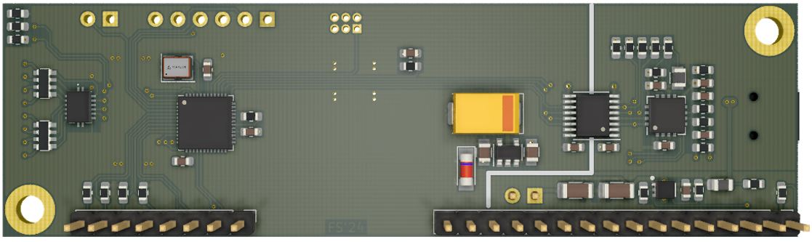
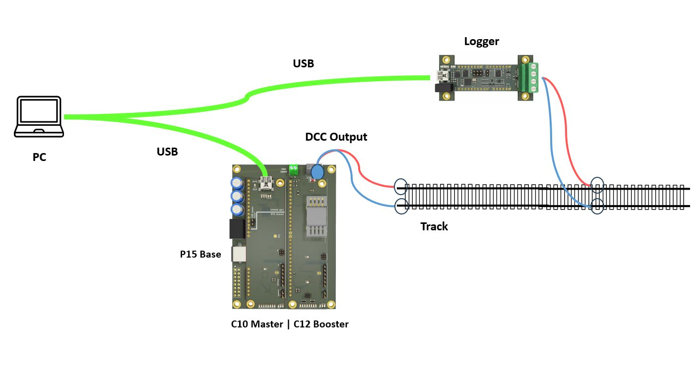

# RTB_C10

My homebrew RTB Bus Master connects the PC with the model railway layout via USB.

See also

- [RTB_C11 - Power](https://github.com/git4dcc/RTB_C11)
- [RTB_C12 - Booster](https://github.com/git4dcc/RTB_C12)
- [RTB_P15 - Base](https://github.com/git4dcc/RTB_P15)

User Guides

- User Guide - DE
- [User Guide - EN](https://rtb4dcc.de/rtb_user_guide_en/)

## Master features
- **USB**
  - USB 2.0 (3Mbps full duplex)
  - Mini-B connector
  - firmware update over USB
  - galvanic isolated
- **Power over USB**
  - active limited to 500mA
  - short circuit protection
- **bus master**
  - FDX bus head (2Mbps full douplex)
  - fail safe operation

# Hardware
My current PCB layout uses SMD footprints with 0.4mm pitch and postly 0603 parts. Reflow soldering is my recommendation, but with some experience handsoldering is also possible.

## PCB
- 2-layer PCB, FR4, 1.6mm
- CPU: AVR64DB48
- USB: FT232X (Mini-B)
- PMIC: TPS2552DRVT

## Kicad
[Schematic](doc/C10_schematic.pdf) | [Layout](doc/C10_layout.pdf) | [Gerber](gerber)

Dependency

 

:yellow_circle: Requires my Kicad project library [RTB_SamacSys](https://github.com/git4dcc/RTB_SamacSys) in the same directory tree.

## Firmware
Filename structure: { **pcb** }{ **code** }{ **version** }.hex

Example: **C10F0001**.hex

|   | Description |
| --- | --- |
| **pcb** | Name of matching hardware (**C10**) |
| **code** | Type of code contained (**R**=rom, **B**=bootloader, **F**=flash, **U**=bld update, **P**=UPDI factory code) |
| **version** | Release version (**####**) |

# Images

